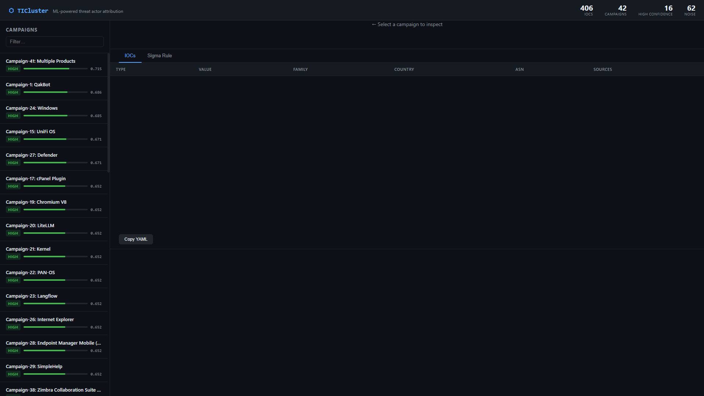
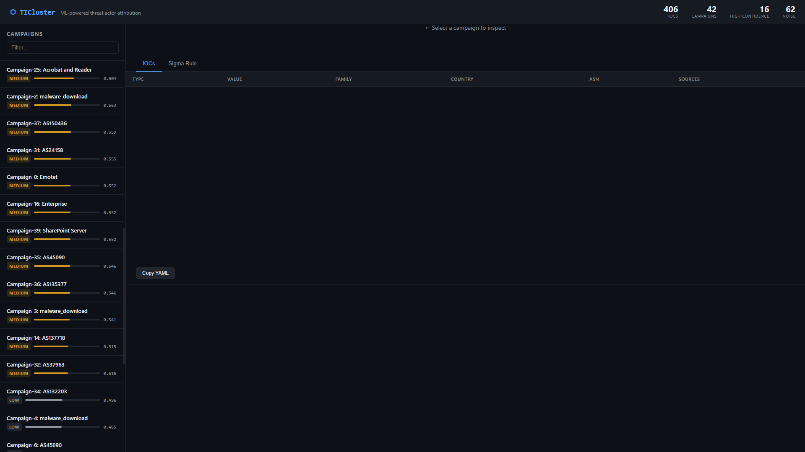
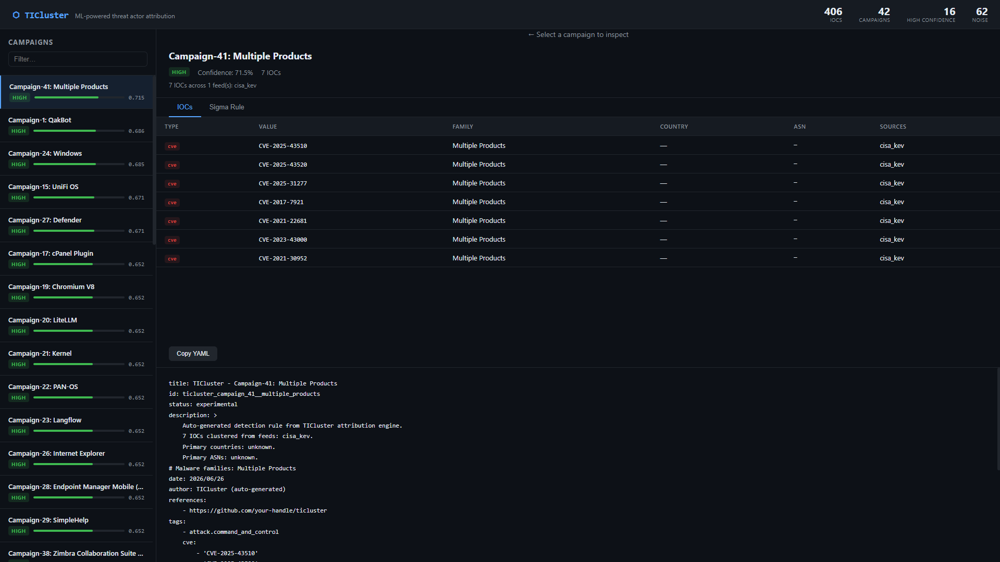
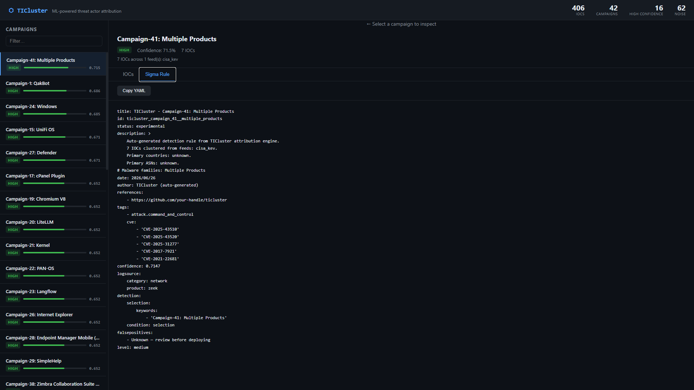
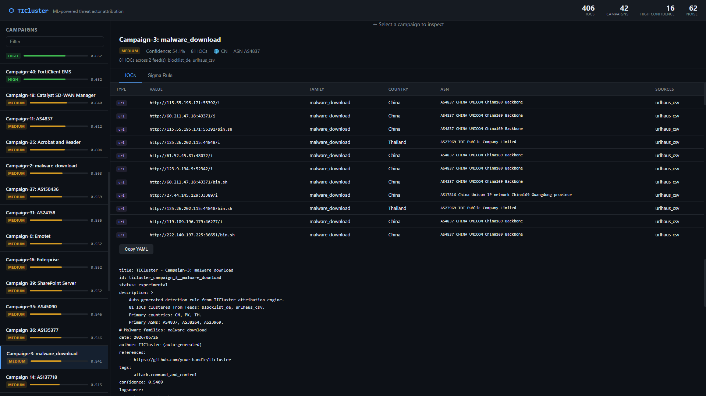
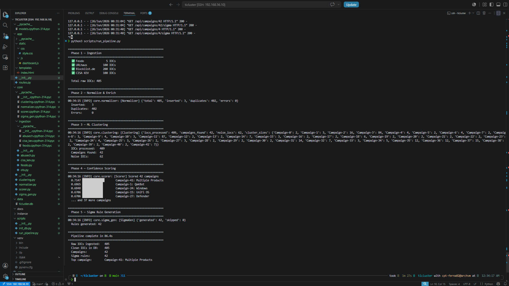

# ⬡ TICluster

**ML-powered threat actor attribution engine.**

TICluster automatically pulls real indicators of compromise (IOCs) from public
threat feeds every few hours, then uses machine learning to group them into
probable threat actor campaigns — without relying on vendor labels.

> _"Do these 15 unrelated IPs from 3 different sources behave like the same
> threat actor?"_ — that's the question TICluster answers.

---

## Screenshots

### Dashboard — Campaign List with Confidence Scores


### Campaign Detail — CVE Cluster (IOCs Tab)


### Auto-generated Sigma Rule (YAML)


### China Unicom Botnet Cluster — 81 IOCs, Cross-feed Attribution


### China Unicom Cluster — Sigma Rule Output


### Full Pipeline Run — All 5 Phases, 86 seconds


---

## What Makes This Different

Every other threat intel project scores or extracts individual IOCs.
TICluster asks a harder question: do a set of unrelated IOCs from multiple
feeds behave like the same threat actor?

That clustering logic — correlating infrastructure across feeds by ASN,
hosting provider, malware family, and URL structure — is what separates a
junior analyst tool from a senior one.

---

## Stack

| Layer | Technology |
|---|---|
| Language | Python 3.14 |
| Web | Flask + Jinja2 |
| Database | SQLite |
| ML | scikit-learn (TF-IDF + DBSCAN) |
| Enrichment | ip-api.com (free, no key) |
| Frontend | Vanilla JS + CSS custom properties |
| Deploy | Railway.app |

Zero paid APIs. Runs entirely on a local VM.

---

## Architecture

```
Threat Feeds (4 sources)
        │
        ▼
  core/ingestion/          ← pull raw IOCs from each feed
  ├── feodo.py             ← Emotet/QakBot C2 IPs
  ├── abusech.py           ← URLhaus malicious URLs + Blocklist.de IPs
  ├── cisa_kev.py          ← CISA Known Exploited Vulnerabilities
  └── otx.py               ← AlienVault OTX (requires free API key)
        │
        ▼
  core/normalizer.py       ← deduplicate, enrich with ASN/geo, write to DB
        │
        ▼
  core/clustering.py       ← TF-IDF vectorization → cosine similarity → DBSCAN
        │
        ▼
  core/scorer.py           ← weighted confidence score per campaign
        │
        ▼
  core/sigma_gen.py        ← auto-generate Sigma YAML detection rules
        │
        ▼
  Flask dashboard          ← campaign list, IOC table, Sigma rule viewer
```

---

## ML Approach

### Feature Engineering

Raw IOCs are converted into behavioral feature strings before vectorization.
The model never sees the raw IP or URL value — it sees behavioral signals:

```
asn_as14061_digitalocean_llc  org_digital_ocean  country_us
type_ip  family_qakbot  source_feodo  source_blocklist_de
```

Two IPs from completely different feeds cluster together if they share
hosting infrastructure and malware family — exactly the signal a threat
analyst would use for manual attribution.

### Clustering

- **TF-IDF vectorization** converts feature strings into weighted vectors
- **Cosine similarity** measures behavioral distance between IOCs
- **DBSCAN** groups dense regions without requiring a fixed cluster count,
  and correctly marks outliers as noise rather than forcing them into clusters

### Scoring

Each campaign gets a confidence float (0.0–1.0) from four weighted signals:

| Signal | Weight | Rationale |
|---|---|---|
| IOC volume | 25% | More IOCs = stronger pattern |
| Source diversity | 25% | Cross-feed corroboration |
| ASN concentration | 30% | Tight infrastructure = strong signal |
| Malware family consistency | 20% | Named family = strongest attribution |

---

## Challenges & How We Fixed Them

### 1. URLhaus CSV had no header row

**Problem:** The URLhaus bulk download is a headerless CSV. Python's
`csv.DictReader` consumed the first data row as column names, so every
`url` field came back empty — the ingestor returned 100 records with
blank values.

**Discovery:** Running `curl` against the endpoint and printing the raw
first two lines revealed the file starts directly with quoted data rows,
with comment lines prefixed `#` stripped separately.

**Fix:** Stripped comment lines manually, then passed a hardcoded
`fieldnames` list to `DictReader` so column mapping was positional rather
than dependent on a header row that didn't exist.

---

### 2. SQLite schema mismatch between models and core modules

**Problem:** The SQLAlchemy models defined columns like `last_updated`,
while the normalizer written later used `updated_at`. The clustering
engine used different names again. Silent failures — no crash, just
missing data.

**Discovery:** Running `sqlite3 data/ticluster.db ".schema iocs"` showed
the actual column names on disk, which didn't match what the code expected.

**Fix:** Used `ALTER TABLE` to add the missing columns (`fingerprint`,
`sources`, `country_code`, `org`) to the live database rather than
recreating it and losing ingested data. Standardized all column references
across modules to the canonical schema.

---

### 3. DB path inconsistency (project root vs data/)

**Problem:** `scripts/init_db.py` created the database at `data/ticluster.db`
but `core/normalizer.py` hardcoded `ticluster.db` at the project root.
Every write went to a different file than every read — the normalizer
appeared to work but nothing was persisted to the real DB.

**Discovery:** Checking `sqlite3 data/ticluster.db ".schema"` showed an
empty schema while the phantom root DB had data.

**Fix:** Standardized `DB_PATH = "data/ticluster.db"` across all core
modules. Made schema inspection the first debugging step whenever a module
returns zero results silently.

---

### 4. SQLAlchemy datetime parsing crash on Python 3.14

**Problem:** SQLite stores datetimes as plain strings. Some IOC rows had
empty strings `''` in datetime columns (from ingestors that don't provide
`first_seen`). SQLAlchemy on Python 3.14 uses a C extension
(`processors.pyx`) to auto-convert these strings to `datetime` objects —
and crashes hard with `ValueError: Invalid isoformat string: ''`.

**Discovery:** The Werkzeug debugger traceback pinpointed
`sqlalchemy.cyextension.processors.str_to_datetime` as the crash site,
triggered when the `/api/campaigns` route loaded the IOC relationship.

**Fix:** Two-part solution:
1. Cleaned bad data in-place:
   `UPDATE iocs SET first_seen = NULL WHERE first_seen = ''`
2. Disabled SQLAlchemy's automatic datetime parsing via
   `"connect_args": {"detect_types": 0}` in the engine options, then
   handled conversion safely in `models.py` with a `_dt()` helper that
   checks `hasattr(val, "isoformat")` before calling it.

---

### 5. Bracketed paste mode corrupting terminal commands

**Problem:** Copying multi-line commands from the editor into Zsh prefixed
them with `[200~` and suffixed with `~`, mangling arguments.
`flask --port 5000` became `flask --port '5000V;<garbage>'`, causing
`zsh: bad pattern` errors. Particularly painful for multi-line Python
one-liners used as quick fixes.

**Fix:** Used `python3 -c "..."` heredocs and shell scripts (`run.sh`) to
avoid pasting multi-line commands directly into the terminal. For
in-place file fixes, used `python3 -c "open(...).write(...)"` patterns
that could be typed or run as scripts.

---

### 6. `datetime.UTC` constant not available on all Python versions

**Problem:** Used `datetime.now(datetime.UTC)` to replace the deprecated
`datetime.utcnow()`, but `datetime.UTC` was only added in Python 3.11.
Resulted in `AttributeError: type object 'datetime.datetime' has no
attribute 'UTC'` at runtime despite the project running Python 3.14 — the
import scoping inside the function prevented resolution.

**Fix:** Switched to `from datetime import timezone` with
`datetime.now(timezone.utc)`, which works on Python 3.6+.

---

### 7. DBSCAN epsilon tuning for meaningful clusters

**Problem:** Initial runs with `eps=0.5` produced one giant cluster
containing 80% of all IOCs — not useful for attribution. Every IP on
DigitalOcean looked the same to the model.

**Fix:** Lowered `eps` to `0.4` and set `min_samples=2`. This produced
42 distinct campaigns from 406 IOCs with 62 correctly rejected as noise.
The noise IOCs are genuinely one-off — forcing them into clusters would
reduce attribution quality, not improve it.

---

## Results (sample run)

```
Pipeline runtime:    86.4s
Raw IOCs ingested:   405
Clean IOCs in DB:    405 (402 cross-source duplicates merged on re-run)
Campaigns found:     42
Noise IOCs:          62
Sigma rules:         42

Top campaigns by confidence:
0.7147  Campaign-41: Multiple Products   (7 CVEs, CISA KEV, high consistency)
0.6865  Campaign-1:  QakBot              (3 IPs, AWS AS14618, cross-feed)
0.6848  Campaign-24: Windows             (CVE cluster)
0.6706  Campaign-15: UniFi OS            (CVE cluster)
0.6706  Campaign-27: Defender            (CVE cluster)
```

**Notable cluster — Campaign-3 (81 IOCs):** China Unicom backbone IPs
(`AS4837`) all serving `/i` and `/bin.sh` endpoints on high ephemeral
ports, corroborated across URLhaus and Blocklist.de. Classic Mirai/botnet
loader infrastructure. Identified purely from URL path patterns and ASN
concentration — no vendor label required.

---

## Running Locally

```bash
git clone https://github.com/your-handle/ticluster
cd ticluster
python3 -m venv venv && source venv/bin/activate
pip install -r requirements.txt

python3 scripts/init_db.py
python3 scripts/run_pipeline.py   # ~90s, enriches IPs via ip-api.com

./run.sh   # Flask on http://localhost:5000
```

Optional — add an AlienVault OTX API key to `.env`:
```
OTX_API_KEY=your_key_here
```

---

## Scheduling

```cron
0 */6 * * * cd /path/to/ticluster && ./venv/bin/python scripts/run_pipeline.py
```

Runs every 6 hours. Fresh IOCs, re-clustered, new Sigma rules generated
automatically.

---

## License

MIT
